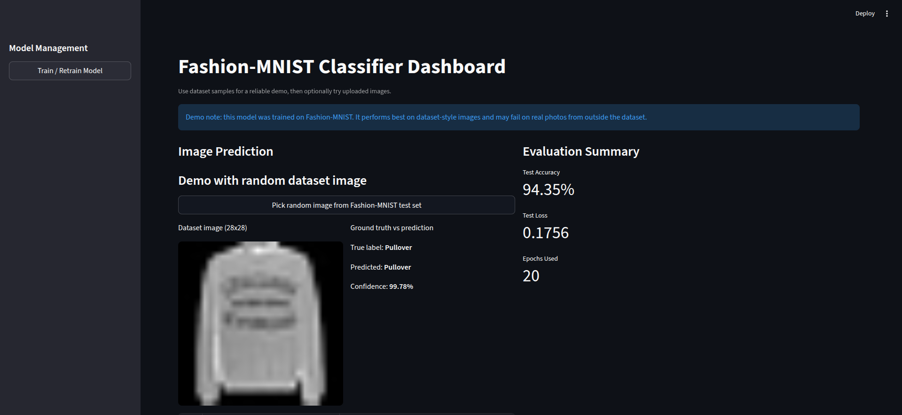
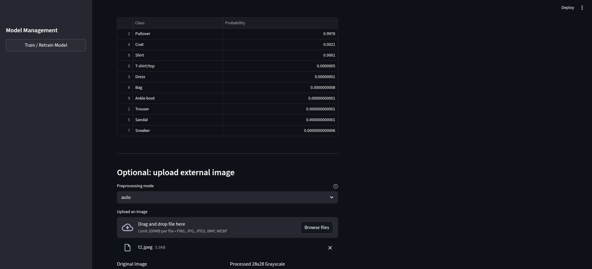
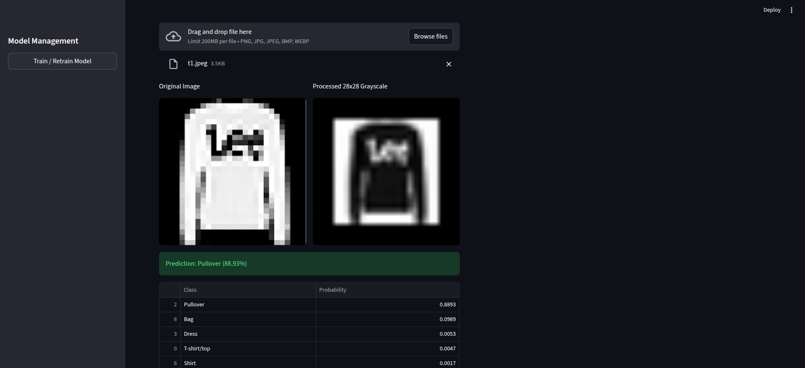
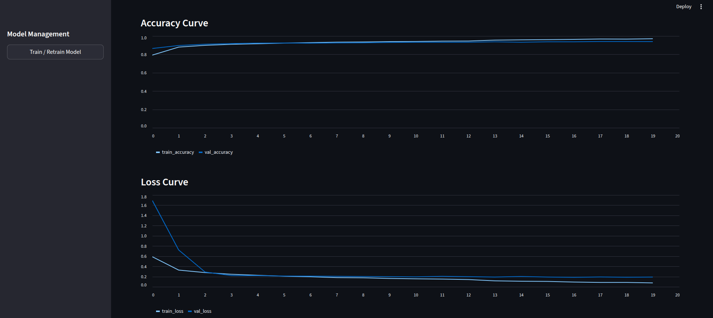
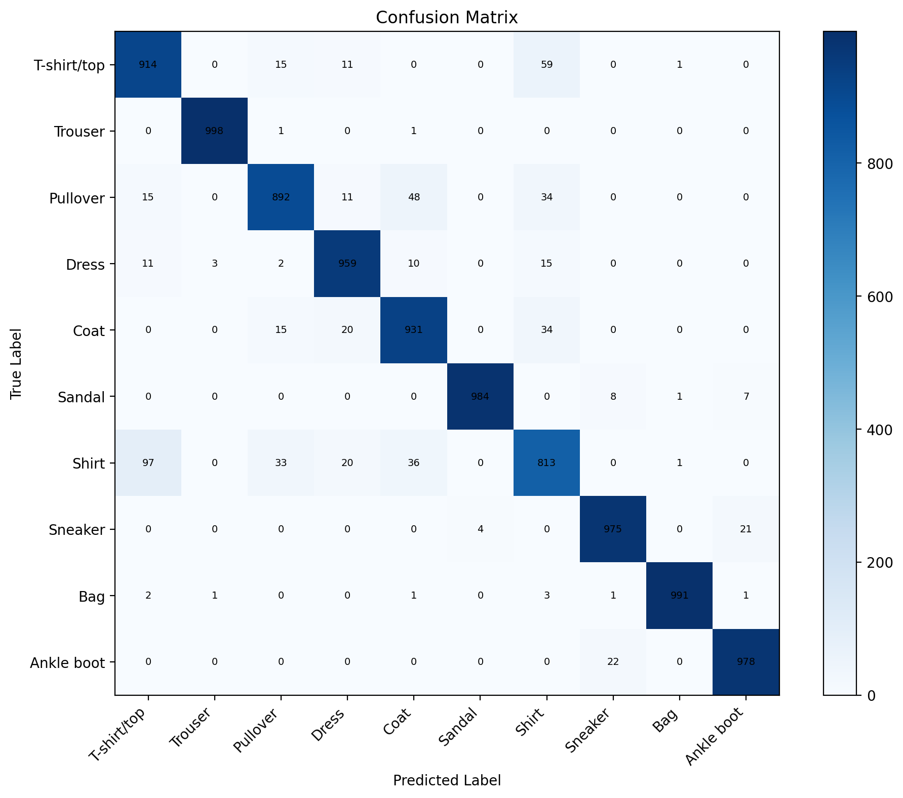

# Fashion-MNIST Classifier

A CNN-based image classifier for Fashion-MNIST with:
- model training and evaluation scripts
- saved artifacts (model, metrics, confusion matrix, report)
- an interactive Streamlit dashboard for demo and predictions

## Project Goal

This project classifies grayscale 28x28 clothing images into 10 classes:
- T-shirt/top
- Trouser
- Pullover
- Dress
- Coat
- Sandal
- Shirt
- Sneaker
- Bag
- Ankle boot

## Important Demo Note

The model is trained on Fashion-MNIST only. It performs best on dataset-style images and may not generalize well to real-world photos.

For a stable demo, use the built-in random dataset image flow in the Streamlit app, then optionally show external image uploads as a known limitation.

## Screenshots

### Dashboard Home

[](src/screenshots/fashion_home.png)

### Random Dataset Prediction

[](src/screenshots/fashion2.png)

### External Image Upload

[](src/screenshots/fashion3.png)

### Training Curves

[](src/screenshots/fashion4.png)

## Repository Structure

```text
.
├── app.py
├── requirements.txt
├── explore_and_train_model.ipynb
├── data/
│   └── fashion-mnist_*.csv
├── model/
│   ├── best_fashion_mnist.keras
│   ├── fashion_mnist.keras
│   ├── history.json
│   ├── metrics.json
│   ├── confusion_matrix.npy
│   ├── confusion_matrix.png
│   └── classification_report.json
└── src/
  ├── screenshots/
  │   ├── confusion_matrix.png
  │   ├── fashion_home.png
  │   ├── fashion2.png
  │   ├── fashion3.png
  │   └── fashion4.png
    ├── train_model.py
    └── preprocess_image.py
```

The Fashion-MNIST CSV files are expected under `data/` when you train or run the app locally, but they are not tracked in git because of file size limits.

## Tech Stack

- Python 3.10+
- TensorFlow / Keras
- Streamlit
- NumPy, Pandas, scikit-learn
- Matplotlib, Pillow

## Setup

1. Clone the repository and move into the project folder.
2. Create a virtual environment.
3. Install dependencies.

```bash
python -m venv .venv
source .venv/bin/activate
pip install -r requirements.txt
```

## Train the Model

Run the training script:

```bash
python -m src.train_model
```

Optional arguments:

```bash
python -m src.train_model \
  --train_csv data/fashion-mnist_train.csv \
  --test_csv data/fashion-mnist_test.csv \
  --output_dir model \
  --epochs 20 \
  --batch_size 256
```

Artifacts are saved in the `model/` folder.

## Run the Streamlit Dashboard

```bash
streamlit run app.py
```

Dashboard sections include:
- random Fashion-MNIST sample prediction (recommended for demo)
- optional external image upload and preprocessing
- evaluation summary (accuracy, loss, epochs)
- training curves (accuracy/loss)
- confusion matrix

## Evaluation Preview

The model currently achieves the following on the test set:

- Test accuracy: 94.35%
- Test loss: 0.1756

### Confusion Matrix

[](src/screenshots/confusion_matrix.png)

## Recommended Demo Flow

1. Open the dashboard.
2. Use "Pick random image from Fashion-MNIST test set".
3. Show:
   - dataset image
   - true label vs predicted label
   - confidence and class probabilities
4. Explain that this is in-distribution performance.
5. Optionally upload a real photo to show out-of-distribution limitations.

## Notes on Preprocessing for Uploaded Images

Uploaded images are converted to grayscale, optionally inverted, centered, resized to 28x28, normalized, and reshaped to model input shape.

Because real photos differ strongly from Fashion-MNIST style, prediction quality can drop significantly.

## Troubleshooting

- If the app says model artifacts are missing, train first with `python -m src.train_model`.
- If TensorFlow installation fails, make sure your Python version is compatible with the TensorFlow version in `requirements.txt`.
- If predictions on uploaded images look incorrect, try changing preprocessing mode (`auto`, `always`, `never`) in the app.

## Future Improvements

- Train with stronger augmentation and domain adaptation.
- Use transfer learning on real clothing images.
- Build a mixed dataset (Fashion-MNIST + real-world images) for better generalization.
- Add calibration metrics for confidence reliability.

## License

This project is licensed under the MIT License. See the `LICENSE` file for details.
